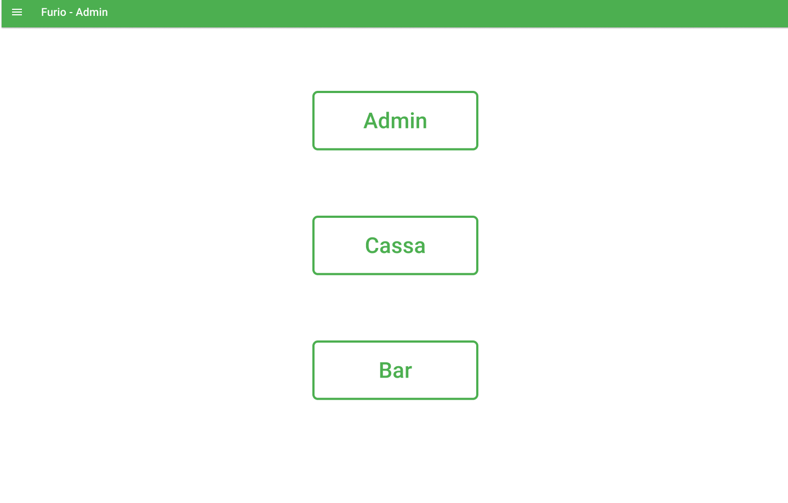
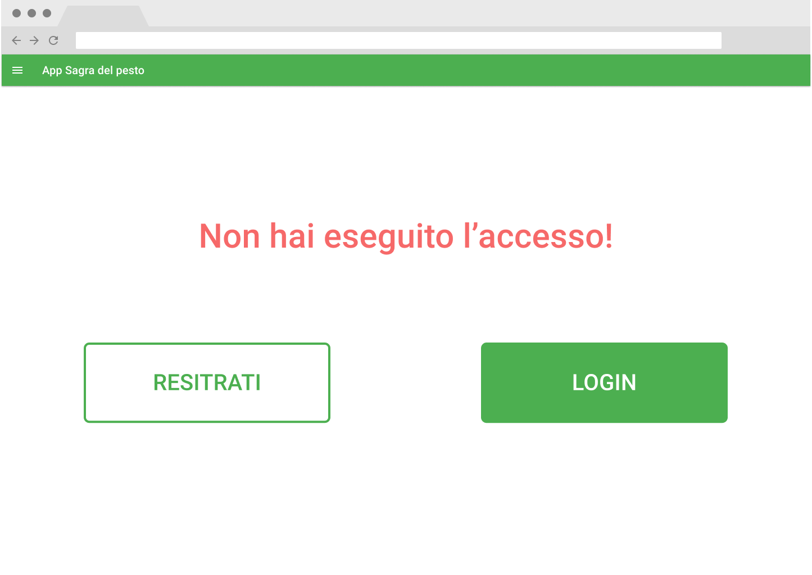
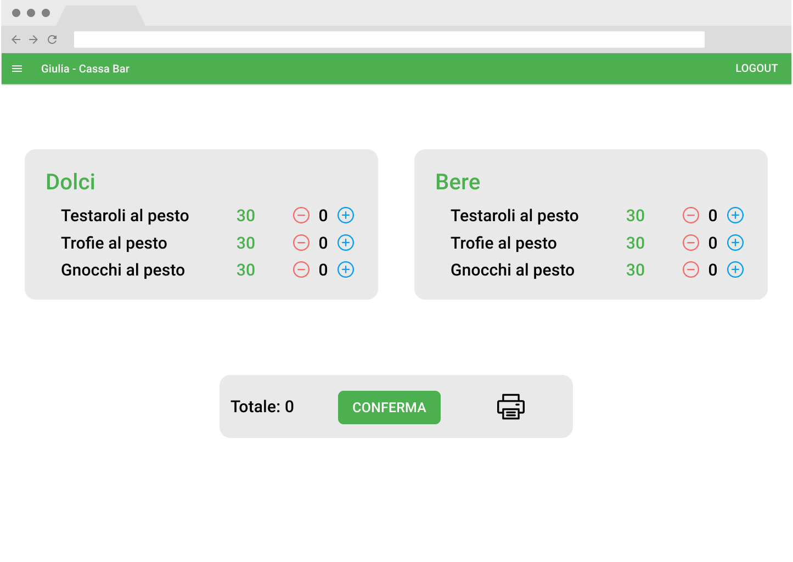
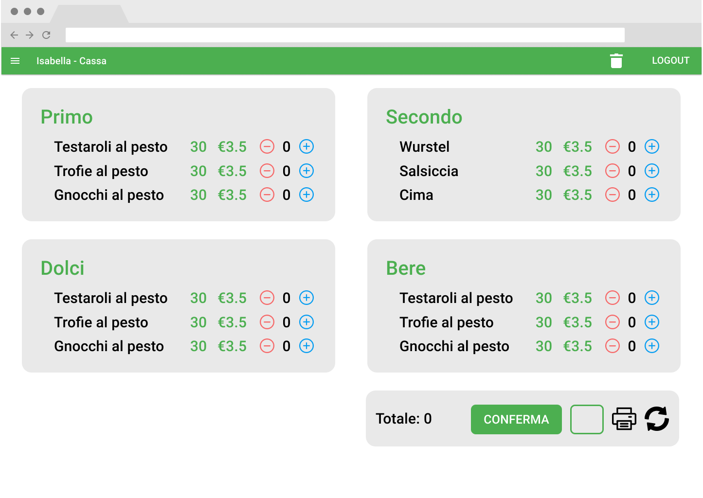
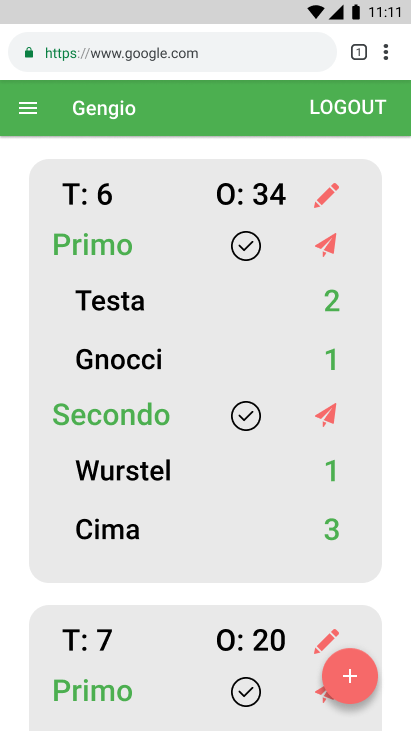
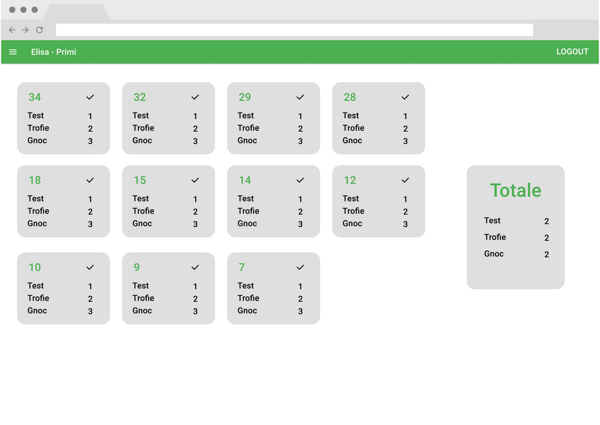
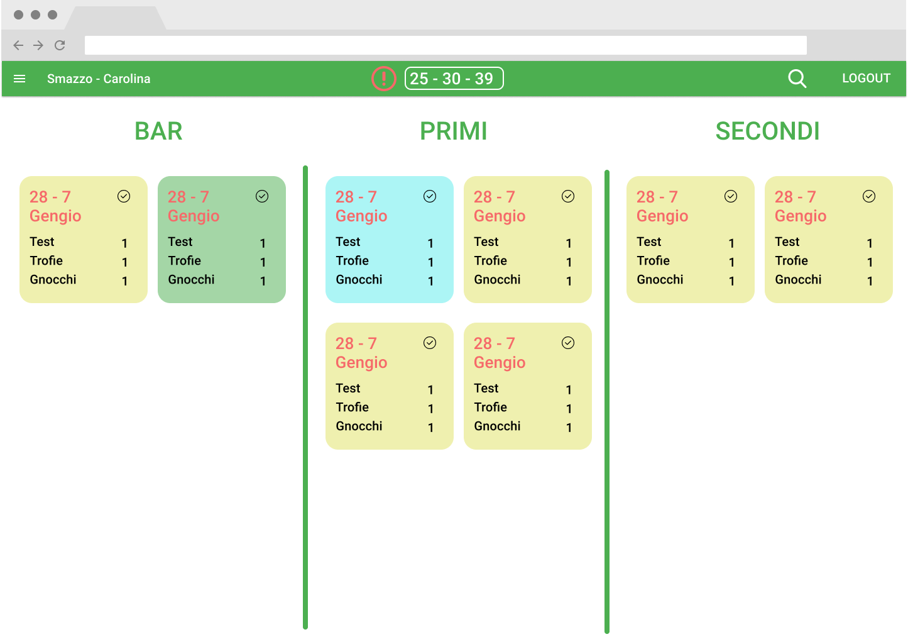

# App - Sagra del pesto
Di seguito la documentazione dell'app per gestire gli ordini della Sagra del Pesto di Genova. La prima parte descrive il funzionamento dell'app, la seconda descrive la guida per l'implementazione.

# Indice
- [Parte I - funzionamento](#parte-i---funzionamento)
  - [Obbiettivi](#obbiettivi)
  - [Evoluzione di un ordine](#evoluzione-di-un-ordine)
  - [Ruoli utente](#ruoli-utente)
  - [Attività dei ruoli](#attività-dei-ruoli)
  - [Permessi dei ruoli](#permessi-dei-ruoli)
  - [Pagine](#pagine)
  - [Stima dei costi](#stima--dei-cost)
- [Parte II - implementazione](#parte-ii---implementazione)
  - [Cloud functions](#cloud-functions)
  - [Firestore DB structure](#firestore-db-structure)
  - [Security rules](#security-rules)
  - [Typescript Interfaces](#typescript-interfaces)
  - [URLs](#urls)
  - [React Components](#react-components)
  - [Logging](#logging)

<div style="page-break-after: always;"></div>

# Parte I - funzionamento
## Obbiettivi
L'applicazione ha l'obbiettivo di migliorare la gestione degli ordini della sagra, fornendo:
- miglior interazione tra i vari organi operativi
- aggiornamenti in tempo reale sullo stato degli ordini
- maggiore visione d'insieme da parte di smazzo e responsabili
- interfacce personalizzate per ciascun utente in base al ruolo
- possibilità di analisi dei dati post-sagra per poter migliorare le spese e l'organizzazione
- un'architettura google cloud per una maggiore affidabilità e resilienza dei dati
- un prodotto espandibile e modificabile per fondare le basi dell'informatizzazione della sezione di Genova

## Evoluzione di un ordine
Alcune nozioni fondamentali riguardo l'app:
- servizio: sessione di pasto (pranzo, cena)
- ordine istantaneo: ordine fatto dal bar che viene consegnato al cliente direttamente
- ordine (classico): ordine normale fatto dalla cassa che deve passare attraverso cameriere -> cucina -> smazzo
- portata: elemento dell'ordine elaborato da una singola cucina
- piatto: elemento di una portata

L'app prevede che ogni membro attivo durante un servizio possieda un account (a parte forse alcuni camerieri). L'utilizzo è consentito esclusivamente agli utenti loggati, con certe limitazioni in base al ruolo. Un utente può avere più ruoli.

L'elemento minimo dell'app è la portata di un ordine. E' l'oggetto che viene passato tra i vari 'centri' operativi della sagra.

L'evoluzione temporale di un ordine è la seguente:
1. il cliente arriva alla cassa
2. il cassiere manda l'ordine al sistema
3. lo smazzo vede la presenza di un ordine non ancora collegato a un cameriere
4. il cliente si siede
5. il cameriere collega l'ordine al suo tavolo
6. il cameriere invia una portata alle cucine
7. la cucina responsabile della portata vede la presenza di una portata da preparare
8. la cucina prepara la portata e la segna come 'pronta'
9. lo smazzo e il cameriere vedono l'update
10. lo smazzo controlla che l'ordine si stato realizzato correttamente e lo passa al cameriere per portarlo al tavolo
11. si ripete dal punto 4 al puntto 10 per ogni portata

<div style="page-break-after: always;"></div>

## Ruoli Utente 
- [Super Admin](#super-admin)
- [Admin](#admin)
- [Cassiere](#cassiere)
- [Cameriere](#cameriere)
- [Bar](#bar)
- [Primi](#primi)
- [Secondi](#secondi)
- [Smazzo](#smazzo)

## Attività dei ruoli
#### Super admin
- modificare i ruoli degli utenti 
#### Admin
- modificare il 'magazzino'
- modificare il menu
- iniziare e concludere il servizio
- vedere info su incassi e ordini correnti
#### Cassiere
- creare un ordine
- stampare un ordine
- modificare un ordine già creato
#### Cameriere
- associare ordine e tavolo
- mandare una portata di un ordine in preparazione
- concludere una portata di un ordine
- modificare un ordine
- _LAST_ ricevere modifica quando un ordine è pronto
#### Bar
- visualizzare il bere e i dolci degli ordini che sono in preparazione
- cambiare lo stato del bere e dei dolci quando sono pronti
- creare ordini istantanei
#### Primi
- visualizzare i primi degli ordini che sono in preparazione
- cambiare lo stato dei primi quando sono pronti
#### Secondi
- visualizzare i secondi degli ordini che sono in preparazione
- cambiare lo stato dei secondi quando sono pronti

#### Smazzo
- vedere gli ordini non collegati a un cameriere
- vedere le portate degli ordini in corso e il loro stato (in preparazione, pronto)
- concludere una portata di un ordine
- recuperare vecchie portate di ordini già conclusi per eventuali modifiche

## Permessi dei ruoli

#### Modifica ruoli utente
-  Super admin
#### Modifica menu
- Admin
#### Inizio/fine servizio
- Admin
#### Creazione ordine
- Cassa solo ordini classici
- Bar solo ordini istantanei
#### Modifica ordine
- Cassa modifica tutto
- Smazzo modifica solo lo stato
- Cameriere modifica tutto solo i propri ordini
- Cucine modificano solo le proprie portate

<div style="page-break-after: always;"></div>

## Pagine

Ogni pagina ha una top bar con:
- se loggato:
  - il nome dell'utente e il tipo di interfaccia (es: Furio-admim)
  - un'icona per mostrare il menu con i link alle pagine accessibili dall'utente
  - un tasto per uscire dall'app
  - se ruolo è 'smazzo'
    - una sezione con gli ordini pendenti
    - un tasto cerca per visualizzare una portata di un ordine
  - se ruolo è cassa:
    - un tasto cerca per modificare un ordine già fatto

<div style="page-break-after: always;"></div>

#### Home
- Link che portano alle altre pagine
<table><tr><td>
  
</td></tr></table>

#### Login
- Tasti per registrarsi o loggarsi

<table><tr><td>
  
</td></tr></table>

<div style="page-break-after: always;"></div>

#### Admin
- Una sezione per:
  - modificare il menu
  - modificare le quantità in magazzino
  - aggiungere e modificare piatti 
- Un tasto per iniziare/concludere il servizio (verde per aprilo e rosso per chiuderlo)
- Una sezione per le info su ordini e incassi del servizio corrente

<table><tr><td>
  
</td></tr></table>

<div style="page-break-after: always;"></div>

#### Cassa istantanea
- Una sezione per ogni portata con i piatti istantanei nel menu. Ogni piatto è una riga con:
  - la quantità rimanente in magazzino
  - il prezzo
  - la quantità richiesta dal cliente
  - un tasto '-' per decrementare le quantità richieste dal cliente
  - un tasto '+' per incrementare le quantità richieste dal cliente
- Una sezione con:
  - il totale dell'ordine
  - un tasto per confermare l'ordine

<table><tr><td>
  
</td></tr></table>

<div style="page-break-after: always;"></div>

#### Cassa
- Una sezione per ogni portata con i piatti nel menu. Ogni piatto è una riga con:
  - la quantità rimanente in magazzino
  - il prezzo
  - la quantità richiesta dal cliente
  - un tasto '-' per decrementare le quantità richieste dal cliente
  - un tasto '+' per incrementare le quantità richieste dal cliente
- Una sezione contente:
  - il totale dell'ordine
  - un tasto per inviarlo al sistema
  - una box per vedere il numero dell'ordine
  - un tasto per stampare l'ordine
  - un tasto per resettare la pagina a zero

<table><tr><td>
  
</td></tr></table>

<div style="page-break-after: always;"></div>

#### Cameriere
- Un tasto '+' per collegare ordine-cameriere-tavolo
- Una sezione per ogni ordine con: 
  - il numero dell'ordine 
  - il numero del tavolo
  - un tasto per modificare l'ordine
  - le portate dell'ordine, contenente:
    - un tasto per completare la portata 
    - un tasto per mandare la portata in preparazione
    - una riga per piatto con nome e quantità

<table><tr><td>
  

<div style="page-break-after: always;"></div>

#### Cucine/bar
- Una sezione ampia con tutti gli ordini in preparazione della propria cucina, ognuno con un tasto per segnarli completati
- Una mini sezione con il totale dei piatti da preparare attualmente

<table><tr><td>
  
</td></tr></table>

<div style="page-break-after: always;"></div>

#### Smazzo
 - 3 colonne (bar, primi, secondi), contentti le portate degli ordini in corso e il loro stato (preparazione, pronto). Ogni portata contiene:
   - lista dei piatti
   - tasto per concludere la portata

<table><tr><td>
  
</td></tr></table>

<div style="page-break-after: always;"></div>


## Stima dei costi

#### Condizioni e ipotesi
- Prezzi: 0,06/100000r & 0,18/100000w
- n = # portate per ordine ~ 4
- c = # casse collegate ~ 2
- a = # cucine per stessa portata  ~ 1,3
- b smazzi collegati ~ 1
- il cameriere conclude l'ordine, non lo smazzo

#### Creazione ordine:
c+2 r & n+3 w

manca la parte di aggiornamento dell'AdminPage
|  qt   | tipo  | desc                                                   |
| :---: | :---: | ------------------------------------------------------ |
|   1   |   r   | service/current per sapere lastOrderID                 |
|   1   |   w   | service/current per aggiornare lastOrderID e prezzo    |
|   1   |   w   | in service/current/orders per creare un nuovo ordine   |
|   n   |   w   | in service/current/courses per creare le nuove portate |
|   1   |   w   | per aggiornare le quantità in storage                  |
|   c   |   r   | per aggiornare le quantità sulle UI della cassa        |
|   1   |   r   | per aggiornare l'ordine pendente allo smazzo           |

#### Legame cameriere: n+2 r & 1 w     
|  qt   | tipo  | desc                                    |
| :---: | :---: | --------------------------------------- |
|   1   |   r   | per collegamento cameriere ordine       |
|   1   |   r   | per rimozione ordine pendente da smazzo |
|   1   |   w   | per collegamento cameriere ordine       |
|   n   |   r   | per visualizzare le portate dell'ordine |

#### ciclo per ordine: n(2a+3b) r & 3n w
#### ciclo singola portata: 2a+3b r & 3 w 
|    qt     | tipo  | desc                      |
| :-------: | :---: | ------------------------- |
| cameriere |       |
|     1     |   w   | cambio stato wait->prep   |
|     1     |   r   | cambio stato prep->ready  |
|     1     |   w   | cambio stato ready->compl |
|  cucina   |       |
|     a     |   r   | cambio stato wait->prep   |
|     1     |   w   | cambio stato prep->ready  |
|   (a-1)   |   r   | cambio stato prep->ready  |
|  smazzo   |       |
|     b     |   r   | cambio stato wait->prep   |
|     b     |   r   | cambio stato prep->ready  |
|     b     |   r   | cambio stato ready->compl |

#### Totale
| qt           |       r        |   w   |
| :----------- | :------------: | :---: |
| creazione    |      c+2       |  n+3  |
| collegamento |      n+2       |   1   |
| ciclo        |    n(2a+3b)    |  3n   |
| totale       | n(1+2a+3b)+c+4 | 4n+4  |

#### Caso reale: 
n=4 a=2 b=1 c=2 => 38r &  20w

4000 ordini = 152000 r & 80000 w ~ €0.09 & €0.27
#### Caso limite assurdo
ipotesi: 400 r/ordine - 400 w/ordine

4000 ordini = 1600000 r - 1600000 w = $0,96 + $2,56


## Note 
Avere dati sull'evoluzione delle quantità in magazzino

<div style="page-break-after: always;"></div>

# Parte II - implementazione

## Firestore DB structure

#### storage
Only one document which contains an IStorage Object
#### services
Each document is a single service located in time. Each service has 3 subcollections:
- instantOrders
- orders
- courses
#### users
Each document corresponds to a user in the app, it could be useful for future use.
#### userRoles
Each document corresponds to a user and contains a 'roles' property which is a string[] which contains all roles of the user. Each document is linked with a user by its id, building it as  `r_${uid}`.

<div style="page-break-after: always;"></div>

## Security rules
``` js
match / {
  function isLoggedIn() {
    return request.auth.id != null;
  }

  function hasRole(reqRole) {
    request.auth.token.reqRole == true; 
  }

  match /userRoles {
    allow read: if false;
    allow write: if false;
  }

  match /users  {
    allow read: if false;
    allow write: if false;
  }

  match /storage {
    allow read: if isLoggedIn() && hasRole(admin) || hasRole(cassa);
    allow write: if isLoggedIn();
  }
  match /services/{serviceID} {
    match /orders/{orderID} {}
    match /courses/{courseID} {}
    match /instantOrders/{instantOrderID} {}
  }
  allow read: if false;
  allow write: if true;
}
```
<div style="page-break-after: always;"></div>

## Typescript Interfaces

#### services collection
``` ts
interface IService
{
  start: Date,
  end: Date,
  totalRevenue: number,   
  totalPeople: number,     // total number of people
  lastOrderNum : number,   // progressive counter for orders
  totalInstantOrders: number
  totalOrders: number
}
```
#### instantOrders subCollection
``` ts
interface IInstantOrder
{
  revenue: number,
  dishes: Dish[]
}
```

#### orders subCollection
``` ts
interface IOrder
{
  orderNum: number,
  status: string,     // (pending, active, completed, deleted)
  waiterName: string, // display name of waiter
  waiterId: string,   // id of waiter to link
  table: number,
  revenue: number,
  createdAt: Date
}
```
#### courses subCollection
``` ts
interface ICourse
{
  orderNum: number,
  name: string,
  kitchen: string,
  status: string,      // (waiting,prep,ready,delivered)
  dishes: IDish[],
}
```

``` ts
interface IDish
{
  shortName: string,
  qt: number
}
```

#### storage collection
``` ts
interface IStorage
{
  storage : IStorageCourse[]
}
```

``` ts
interface IStorageCourse
{
  name: string,
  kitchen: string,
  dishes: IStorageDish[],
  isInstant: boolean
}
```

``` ts
interface IStorageDish
{
  name: string,
  shortName: string,
  storageQt: number,
  price: number,
  inMenu: boolean
}
```

``` ts
interface IOrderProp extends IOrder
{
  id: string  
}
```
``` ts
interface ICourseProp extends ICourse
{
  id: string  
}
```
``` ts
interface IOrderLinkInfo
{
  orderNum: number,
  tableNum: number,
  waiterName: string
}
```

``` ts
interface IReducerAction
{
  type: string,
  payload: unknown,
}
```

<div style="page-break-after: always;"></div>

## React Components

#### URLs
domain = (e.g. sagra.genova.cngei.it)
- [home](#domain) = domain
- [login](#domain/login) = domain/login
- [admin](#domain/admin) = domain/admin
- [primi](#basebarprimisecondi) = domain/primi
- [secondi](#basebarprimisecondi) = domain/secondi
- [bar](#basebarprimisecondi) = domain/bar
- [cassa](#domain/cassa) = domain/cassa
- [cassaBar](#domain/cassaBar) istantanea = domain/cassaBar
- [cameriere](#domain/cameriere) = domain/cameriere

Assumption (need to be checked during development): for all Components where a user event triggers a change in firestore there is no need to add a reducer but only a listener that acts on a state. Actions will pass through firestore on-device cache first and then propagate to other UI via DB and then trigger the snapshot. In those components where a reducer is needed there should not be the need also for context, should be maximum 2-level prop-drilling.

Base structure:
- [ ] App
  - [ ] AppBar
    - [ ] MenuDrawer
    - [ ] PendingOrders
    - [ ] SearchButton 
  - [ ] PrivateRoute
  
App
- material UI theme builder
- CSS Baseline
- AppBar
- router with all PrivateRoute for pages except for login
- state = {isLoggedIn : boolean, roles: string[], name: string}
- in useEffect setup onetime listener for firebase.auth() to change state

AppBar (isUserLoggedIn, role)
- on logout redirect to login page
- if userLoggedIn show name, role, logout button
- if user role is 'smazzo' and url is '/smazzo' show also search button and pending orders
- if user role is 'cassa' and url is '/cassa' show also search button

PendingOrders 
- setup firebase snapshot on orders Collection where state='pending'
- state = orders where state='pending'
- if there are more than 1 order show attention icon
- could signal if an order is waiting for too long
- display id of each order

MenuDrawer (userRoles)
- contains links to possible pages for user based on userRoles

PrivateRoute
``` ts
const PrivateRoute = ({component, authed, userRoles, requiredRoles}) => {
  return (
    <Route
      render={(props) => authed !== true  ? 
      <Redirect to={{pathname: '/login', state: {from: props.location}}} />}
        : userRoles.some(role => requiredRoles.includes(role)) ?
        <component {...props} /> 
        // modal for not right role and then redirect to home
    />
  )
}
```
#### domain/
- [ ] HomePage

HomePage (userRoles)
- display a link buttons for each app route reachable by user based on userRoles
- if userRole is empty show message to go to superAdmin and give role

#### domain/login
- [ ] LoginPage
  - [ ] LoginDialog
  - [ ] RegisterDialog

LoginPage
- notLoggedIn messagge
- Login button to trigger LoginDialog
- Register button to trigger RegisterDialog

LoginDialog
- fields: email and password
- on login if user has at least a role redirect to role page else to home

RegisterDialog
- fields: email, password, confirm password, name
- on register if user has at least a role redirect to role page else to home

#### domain/admin
- [ ] AdminPage
  - [ ] Storage
    - [ ] StorageCourse
      - [ ] StorageDish 
      - [ ] AddDishButton 
  - [ ] ServiceTab 
    - [ ] ServiceStarter 
    - [ ] ServiceInfo
AdminPage
- 2 sections: 
  - Storage
  - ServiceTab

Storage
- setup listener for storage collection
- state = storage
- map courses of storage to StorageCourse and pass single course as prop

StorageCourse (storageCourse : IStorageCourse)
- map dishes in storageCourse to StorageDish and pass single dish as prop
- _LAST_ plus button to add dish

StorageDish (storageDish : IStorageDish)
- render infos from props
- need to be able to edit qt, price
- state = isEditing
- on editButton click set isEditing to true
- if isEditing==true dish row grays out and edit icon becomes check icon to finish, text input enables
- on checkButton click, update strogae in DB and set isEditing=false

ServiceTab
- setup listener for service where EndDate is null
- state = current service
- if service exists pass isServiceActive=true as prop to serviceStarter else pass false
- if service exists  display ServiceInfo and pass service as prop

ServiceStarter (isServiceActive : boolean)
- if isServiceActive is true show red button to end it, i.e. set endDate where endDate is not defined
- if isServiceActive is not active show green button to start it, i.e. create new service with endDate undefined

ServiceInfo (service : IService)
- display current service info from props


#### domain/cassa
- [ ] CashRegisterPage
  - [ ] CashRegisterCourse
    - [ ] CashRegisterDish
  - [ ] CashRegisterConfirmOrder
  - [ ] CashRegisterSearchButton
  - 


CashRegisterPage
- setup listener for storage
- filter courses from storage where inMenu==true and set them to state(storage)
- useState = storage : IStorageCourse[]
- useReducer =
  - newOrder : {orderNum: number, total: number, courses: IStorageCourse[]}
  - dispatchActions: IReducerAction
    - (ADD_DISH, dishName)
    - (REMOVE_DISH, dishName)
    - SEND_ORDER
    - PRINT_ORDER
    - RESET_ORDER
- map state(storage) to list of CashRegisterCourse, if in newOrder there is a course with same name pass it as prop
- one card with CashRegisterConfirmOrder pass newOrder reduced to total

CashRegisterCourse (courseInMenu : IStorageCourse, courseInOrder ?: IStorageCourse, dispatch)
- map dishes to CashRegisterDish, if in courseInOrder there is a dish with the same name pass the qt as prop as prop

CashRegisterDish (courseInMenu : IDish, newOrderQt : number, dispatch)
- a row with dish name, qt in storage, '-'. '+' and newOrderQt
- on click of '-' and '+' trigger dispatch action with name of dish

CashRegisterConfirmOrder (total: number, orderNum ?: number )
- display total from props
- display sendButton, on click of sendButton dispatch SEND_ORDER action
- display send button on click of printButton dispatch PRINT_ORDER action
- display orderNum
- display resetOrderButton

cash register reducer actions:
- ADD_DISH:
  - copy state and find course where dishes includes a dish with name = payload, increment qt and recalculate total
- REMOVE_DISH:
  - copy state and find course where dishes includes a dish with name = payload, decrement qt and recalculate total
- SEND_ORDER:
  - call createOrder firebase cloud function, then set orderNum as the one received
- PRINT_ORDER:
  - trigger print function
- RESET_ORDER:
 - set newOrder to [] and orderNum to undefined 


CashRegisterSearchButton
- on click trigger UpdateOrderModal

UpdateOrderModal


#### domain/cassaBar
- [ ] InstantCashRegisterPage
  - [ ] CashRegisterCourse
    - [ ] CashRegisterDish
  - [ ] InstantCashRegisterConfirmOrder

InstantCashRegisterPage
- setup firestore listener for storage
- state = all courses in storage where isInstant=true
- add useReducer:
  - state: {newOrder : StorageCourse[]}
  - dispatchActions:
    - ADD_DISH
    - REMOVE_DISH
    - SEND_ORDER
- map state to CashRegisterCourse and pass single course as props

InstantCashRegisterConfirmOrder
- display total from props
- on click of sendButton dispatch SEND_ORDER action

#### domain/cameriere
- [ ] WaiterPage
  - [ ] WaiterOrder 
    - [ ] WaiterOrderCourse
      - [ ] DishRow
  - [ ] LinkOrderButton
  - [ ] LinkOrderModal

WaiterPage
- in one-time useEffect listen for orders with waiterId == user.uuid and status='active' (get from firebase.auth().currentUser)
- map orders to WaiterOrders and pass order as prop + firestoreId

 WaiterOrder
- in one-time useEffect listen for courses with orderId equal to prop one and pass Course obj as prop + docId
- display table# and orderId
- display close button, on click set status='completed'
- display unlink button, on click set status='pending'

WaiterCourse
- when Course state == waiting, display sendToKitchen button
- when Course state == prep, display cancelKitchen button
- when Course state == ready, display conclude button
- map Dishes to DishRow[]
- when click a button change state in db appropriately

DishRow
- display dish shortName e qt

LinkOrderButton
- floating '+' button to trigger LinkOrderModal

LinkOrderModal
- 2 inputs, orderNum and tableNum
- 1 'confirm' button, onClick change tableNum in order

#### domain/(bar,primi,secondi)
  - [ ] KitchenShelf
    - [ ] KitchenCourse
      - [ ] DishRow
  - [ ] KitchenTotal
      - [ ] DishRow

KitchenPage
- in one-time useEffect setup listener for courses were status='prep' and kitchen is equal to url slug
- KitchenShelf pass docs asICourseProp[] prop
- KitchenTotal pass docs as ICourseProp[] prop

KitchenShelf
- map props to KitchenCourse

KitchenCourse
- map props to DishRow

KitchenTotal
- reduce arrayProp to an array of IDIsh and map it to DishRow 

- [ ] [SmazzoPage](#SmazzoPage)
  - [ ] CourseSection
    - [ ] SmazzoCourse

SmazzoPage
- create array with 3 kitchens and map it to a columns in which to render CourseSection and pass kitchen as prop

CourseSection
- setup listener for courses where kitchen is equal to prop and statua in ['prep','ready']
- state = array of courses
- state = array of OrderLinkInfo[]
- foreach document added get from firestore order where ordernum==course.orderNum and insert in OrderLinkInfo[] a new object with infos
- foreach document deleted get from firestore order where ordernum==course.orderNum and remove in OrderLinkInfo[] a new object with infos
- map courses to SmazzoCourse and pass Course and OrderLinkInfo

SmazzoCourse
- render infos
- check button, on click set in db course.status='delivered'
- if status is prep then background is yellowish else greenish

<div style="page-break-after: always;"></div>

## Cloud functions
#### registrazione nuovo utente
- [ ] mettere registrazione in back-end per maggiore sicurezza
#### creazione nuovo ordine (unica transazione)
- [ ] leggere il counter per l'id dell'ultimo ordine
- [ ] creare uno nuovo ordine con l'id incrementato di uno
- [ ] aggiornare lastOrderNum
- [ ] aggiornare il revenue totale del servizio
- [ ] aggiornare le quantità nello storage
- [ ] aggiornare le quantità totale di ordini
#### trigger creazione ordine istantaneo
- [ ] aggiornare la revenue del servizio
- [ ] aggiornare la quantità totale di ordini
#### trigger cancellazione ordine
- [ ] aggiornare la quantità totale di ordini
#### trigger creazione nuovo utente
- [ ] creare un nuovo record nella collezione ruoliUtenti con campo ruoli pari a []
#### trigger rimozione utente
- [ ] eliminare il record corrispondente nella collezione ruoliUtenti
#### trigger modifica ruoli utenti
- [ ] modificare le custom claims di un utente mettendole pari a quelle nel documento

## Logging
L'app deve loggare l'evoluzioni degli ordini per avere dati statistici
