# App - Sagra del pesto

Di seguito la documentazione dell'app per gestire gli ordini della Sagra del Pesto di Genova. La prima parte descrive il funzionamento dell'app, la seconda descrive la guida per l'implementazione. L'app è pensata come parte di un'infrastuttura più generale per gestire l'IT della sezione di Genova.

Le parti precedute da _LAST_ sono funzioni non essenziali che potrebbero non essere presenti nell'app entro giugno.

## Indice

- [Parte I - funzionamento](#parte-i---funzionamento)
  - [Obbiettivi](#obbiettivi)
  - [Evoluzione di un ordine](#evoluzione-di-un-ordine)
  - [Ruoli utente](#ruoli-utente)
  - [Attività dei ruoli](#attività-dei-ruoli)
  - [Permessi dei ruoli](#permessi-dei-ruoli)
  - [Mockup pagine](#mokcup-pagine)
  - [Stima dei costi](#stima-dei-costi)
- [Parte II - implementazione](#parte-ii---implementazione)
  - [Cloud functions](#cloud-functions)
  - [Firestore DB structure](#firestore-db-structure)
  - [Security rules](#security-rules)
  - [Typescript Interfaces](#typescript-interfaces)
  - [URLs](#urls)
  - [React Components](#react-components)
  - [Helper Functions](#helper-functions)
  - [Logging](#logging)

<div style="page-break-after: always;"></div>

## Parte I - funzionamento

### Obbiettivi

L'applicazione ha l'obbiettivo di migliorare la gestione degli ordini della sagra, fornendo:

- miglior interazione tra i vari organi operativi
- aggiornamenti in tempo reale sullo stato degli ordini
- maggiore visione d'insieme da parte di smazzo e responsabili
- interfacce personalizzate per ciascun componente in base al ruolo
- possibilità di analisi dei dati post-sagra per poter migliorare le spese e l'organizzazione
- un'architettura google cloud per una maggiore affidabilità e resilienza dei dati
- un prodotto espandibile e modificabile per fondare le basi dell'informatizzazione della sezione di Genova

[⮝ torna all'indice](#indice)

<div style="page-break-after: always;"></div>

### Evoluzione di un ordine

Alcune nozioni fondamentali sull'app:

- _servizio_: sessione di pasto (pranzo, cena)
- _ordine_ istantaneo: ordine fatto dal bar che viene consegnato al cliente direttamente
- _ordine_ (classico): ordine normale fatto dalla cassa che deve passare attraverso cameriere -> cucina -> smazzo
- _portata_: elemento dell'ordine preparato da una singola cucina
- _piatto_: elemento di una portata
- ogni piatto deve possedere un nome 'corto' di massimo 7 lettere per facilitare la visualizzazione su certe pagine

L'app prevede che ogni membro attivo durante un servizio possieda un account (a parte forse alcuni camerieri). L'utilizzo è consentito esclusivamente agli utenti loggati, con certe limitazioni in base al ruolo. Un utente può avere più ruoli.

La minima entità dell'app è la portata di un ordine. E' l'oggetto che viene passato tra i vari 'centri' operativi della sagra (cameriere, cucina, smazzo).

L'evoluzione temporale di un ordine è la seguente:

1. il cliente arriva alla cassa;
2. il cassiere manda l'ordine al sistema;
3. lo smazzo vede la presenza di un ordine non ancora collegato a un cameriere;
4. il cliente si siede;
5. il cameriere collega l'ordine al suo tavolo;
6. il cameriere invia una portata alle cucine;
7. la cucina responsabile della portata vede la presenza di una portata da preparare;
8. la cucina prepara la portata e la segna come 'pronta';
9. lo smazzo e il cameriere vedono l'update;
10. lo smazzo controlla che l'ordine sia stato realizzato correttamente e lo passa al cameriere per portarlo al tavolo;
11. si ripete dal punto 6 al punto 10 per ogni portata.

[⮝ torna all'indice](#indice)

<div style="page-break-after: always;"></div>

### Ruoli Utente

- [Super Admin](#super-admin)
- [Admin](#admin)
- [Cassiere](#cassiere)
- [Cameriere](#cameriere)
- [Bar](#bar)
- [Primi](#primi)
- [Secondi](#secondi)
- [Smazzo](#smazzo)

[⮝ torna all'indice](#indice)

### Attività dei ruoli

#### Super admin

- modificare i ruoli degli utenti

#### Admin

- modificare le quantità in 'magazzino'
- _LAST_ aggiungere piatti al magazzino
- modificare il menu
- iniziare e concludere il servizio
- vedere info su incassi e ordini correnti

#### Cassiere

- creare un ordine
- aggiungere una nota a ogni portata dell'ordine
- stampare un ordine
- cancellare un ordine già creato
- _LAST_ modificare un ordine già creato

#### Cameriere

- associare ordine e tavolo
- aggiungere una nota personale all'ordine per aiutare l'identificatione dei clienti
- mandare una portata di un ordine in cucina per la preparazione
- concludere una portata di un ordine
- aggiungere una portata a un ordine
- _LAST_ ricevere notifica quando un ordine è pronto

#### Bar

- visualizzare il bere e i dolci degli ordini che sono in preparazione
- segnare il bere e i dolci come pronti
- creare ordini istantanei

#### Primi

- visualizzare i primi degli ordini che sono in preparazione
- segnare i primi come pronti

#### Secondi

- visualizzare i secondi degli ordini che sono in preparazione
- segnare i secondi come pronti

#### Smazzo

- vedere gli ordini non collegati a un cameriere
- vedere le portate degli ordini in corso e il loro stato (in preparazione, pronto)
- concludere una portata di un ordine
- recuperare vecchie portate di ordini già conclusi per eventuali modifiche

[⮝ torna all'indice](#indice)

### Permessi dei ruoli

#### Modifica ruoli utente

- Super admin

#### Modifica menu

- Admin

#### Modifica magazzino

- Admin

#### Inizio/fine servizio

- Admin

#### Creazione ordine

- Ordini classici solo cassa
- Ordini istantanei solo bar

#### Modifica stato ordine

- Cassa
- Smazzo
- Cameriere modifica tutto solo i propri ordini

#### Cancellazione ordine

- Cassa

#### Modifica portate ordine

- Smazzo
- Cameriere modifica tutto solo i propri ordini
- Cucine modificano solo le proprie portate

[⮝ torna all'indice](#indice)

<div style="page-break-after: always;"></div>

### Mokcup pagine

Le immagini mostrate sono delle bozze, non è detto che rispettino fedelmente il prodotto finale.

Ogni pagina ha una top bar con:

- se loggato:
  - il nome dell'utente e la pagina (es: Alice-cassa)
  - un'icona per mostrare il menu con i link alle pagine accessibili dall'utente
  - un tasto per uscire dall'app
  - se il ruolo è 'smazzo'
    - una sezione con gli ordini pendenti
    - un tasto cerca per visualizzare una portata di un ordine
  - se il ruolo è cassa:
    - un tasto 'cestino' per eliminare un ordine già fatto
    - _LAST_ un tasto 'matita' per modificare un ordine già fatto

<div style="page-break-after: always;"></div>

#### Home

- Link che portano alle altre pagine accessibili dall'utente

<br/>
<br/>
<p align="center">
  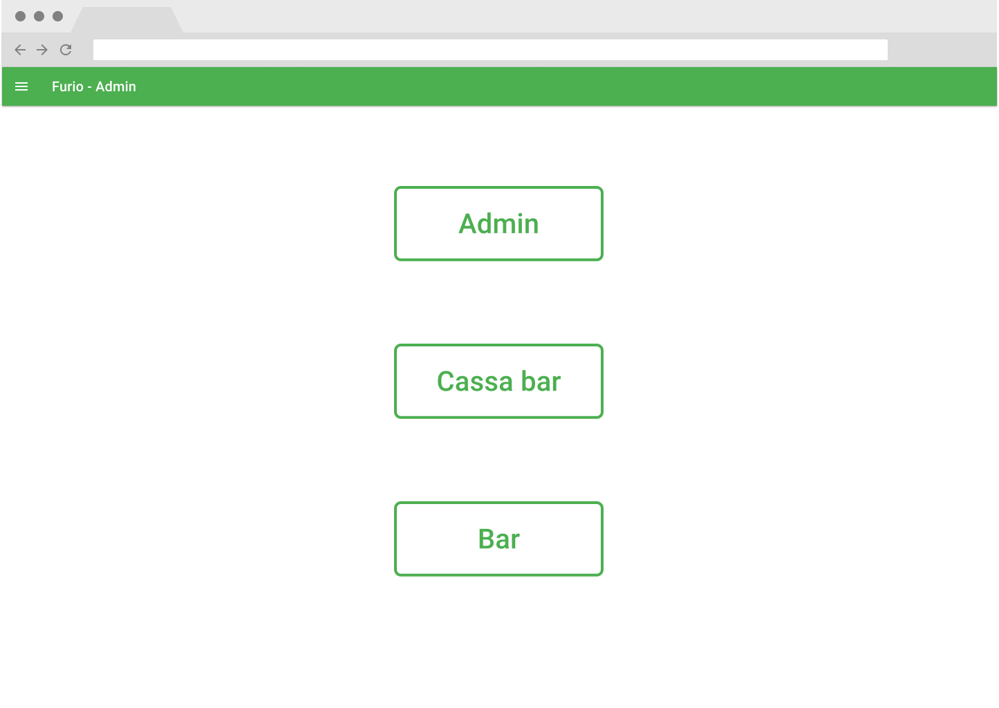
</p>

<div style="page-break-after: always;"></div>

#### Login and Register

- Tasti per registrarsi o loggarsi

<br per lasciare spazio tra testo e immagine >
<br per lasciare spazio tra testo e immagine >
<p align="center">
  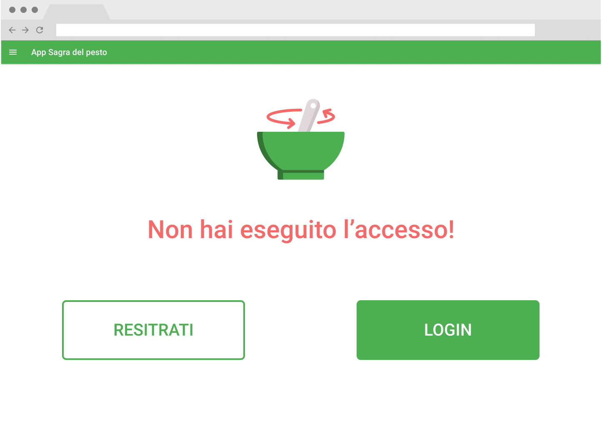
</p>

<div style="page-break-after: always;"></div>

#### Admin dashboard

- Una sezione per:
  - modificare il menu
  - modificare le quantità in magazzino
  - aggiungere e modificare piatti
- Un tasto per iniziare/concludere il servizio
- Una sezione con le info su ordini e incassi del servizio corrente

<br per lasciare spazio tra testo e immagine >
<br per lasciare spazio tra testo e immagine >
<p align="center">
  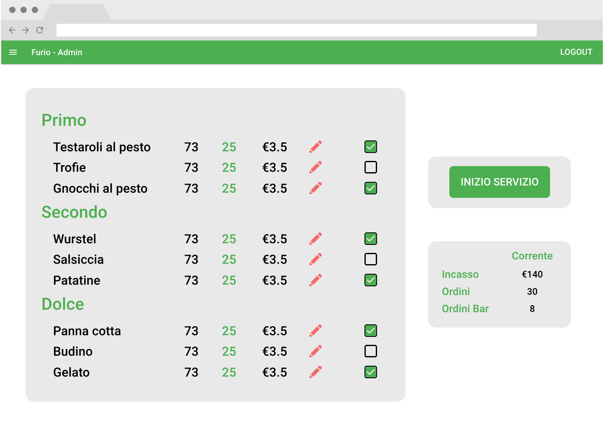
</p>

<div style="page-break-after: always;"></div>

#### Cassa istantanea

- Una sezione per ogni portata con i piatti istantanei nel menu. Ogni piatto è una riga con:
  - la quantità rimanente in magazzino
  - il prezzo
  - la quantità richiesta dal cliente
  - un tasto '-' per decrementare le quantità richieste dal cliente
  - un tasto '+' per incrementare le quantità richieste dal cliente
- Una sezione con:
  - il totale dell'ordine
  - un tasto per confermare l'ordine

<br per lasciare spazio tra testo e immagine >
<br per lasciare spazio tra testo e immagine >
<p align="center">
  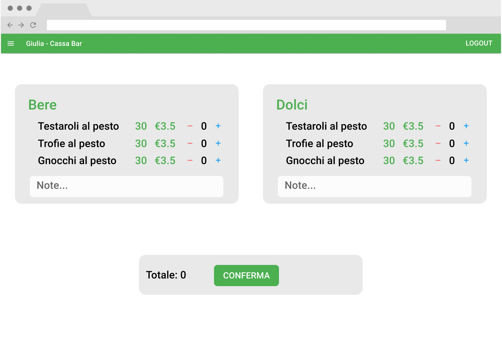
</p>

<div style="page-break-after: always;"></div>

#### Cassa

- Una sezione per ogni portata con i piatti nel menu. Ogni piatto è una riga con:
  - la quantità rimanente in magazzino
  - il prezzo
  - la quantità richiesta dal cliente
  - un tasto '-' per decrementare le quantità richieste dal cliente
  - un tasto '+' per incrementare le quantità richieste dal cliente
- Una sezione contente:
  - il totale dell'ordine
  - un tasto per inviarlo al sistema
  - una box per vedere il numero dell'ordine
  - un tasto per stampare l'ordine
  - un tasto per resettare l'ordine per farne uno nuovo

<p align="center">
  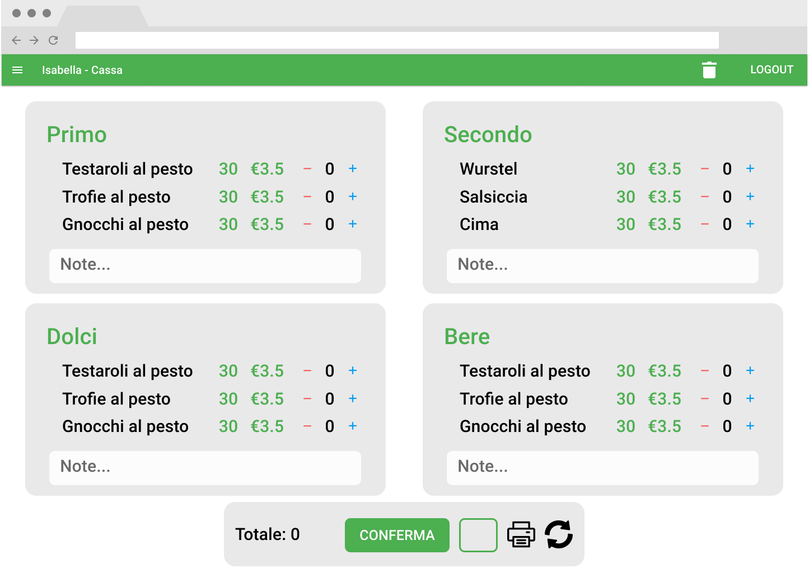
  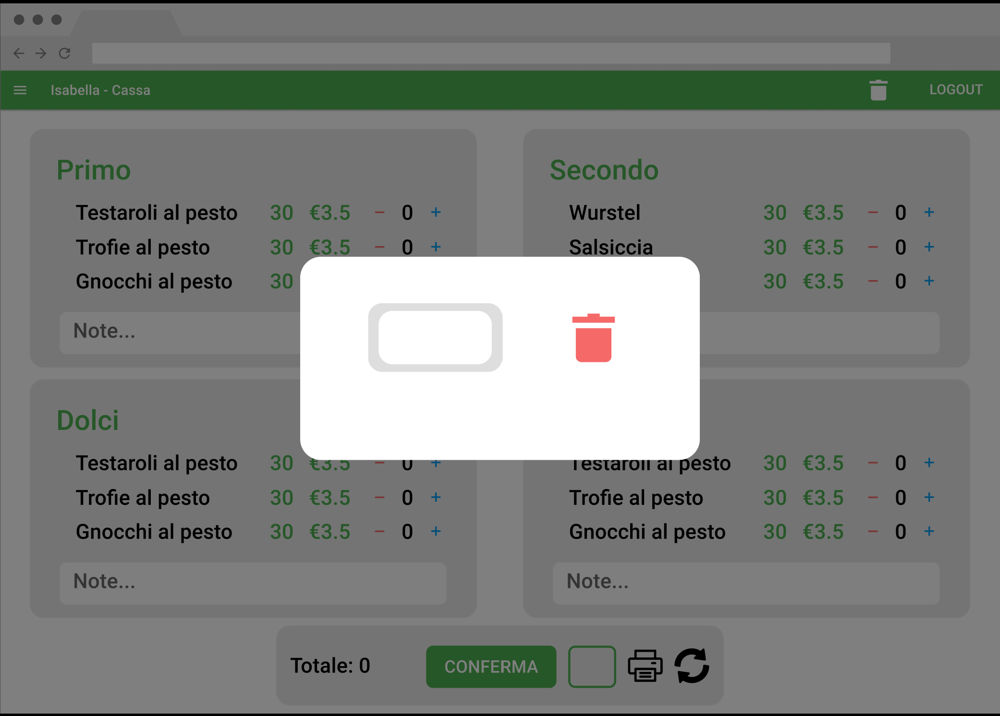
</p>

<div style="page-break-after: always;"></div>

#### Cameriere dashboard

- Un tasto '+' per collegare ordine e tavolo
- Una sezione per ogni ordine con:
  - il numero dell'ordine
  - il numero del tavolo
  - un tasto per aggiungere portate all'ordine
  - un tasto per espandere comprimere l'ordine per non occupare inutile spazio
  - le portate dell'ordine, contenente:
    - un tasto per completare la portata
    - un tasto per mandare la portata in preparazione
    - una riga per piatto con nome e quantità

<br per lasciare spazio tra testo e immagine >
<br per lasciare spazio tra testo e immagine >
<p align="center">
  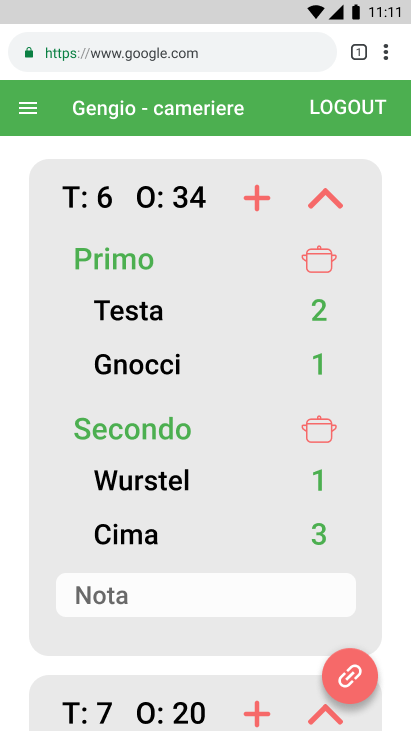
  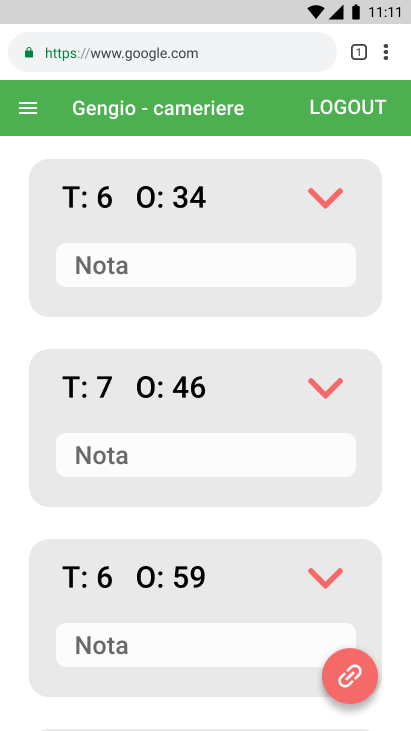
  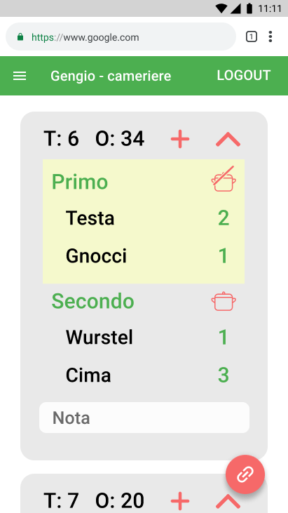
  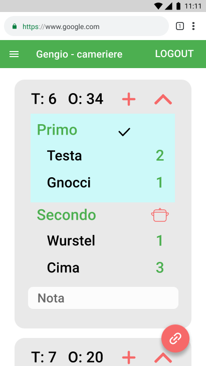
  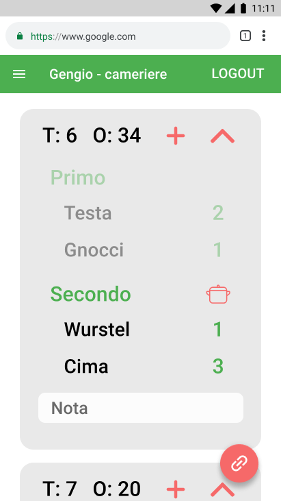
</p>
<div style="page-break-after: always;"></div>

#### Cucine/bar

- Una sezione ampia con tutti gli ordini in preparazione della propria cucina, ognuno con un tasto per segnarli completati
- Una mini sezione con il totale dei piatti da preparare attualmente

<br per lasciare spazio tra testo e immagine >
<br per lasciare spazio tra testo e immagine >
<p align="center">
  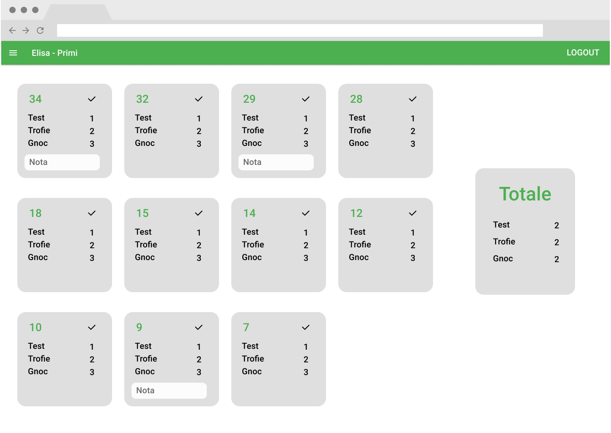
  
</p>

<div style="page-break-after: always;"></div>

#### Smazzo page

- 3 colonne (bar, primi, secondi), contentti le portate degli ordini in corso e il loro stato (preparazione, pronto). Ogni portata contiene:
  - lista dei piatti
  - tasto per concludere la portata

<br per lasciare spazio tra testo e immagine >
<br per lasciare spazio tra testo e immagine >
<p align="center">
  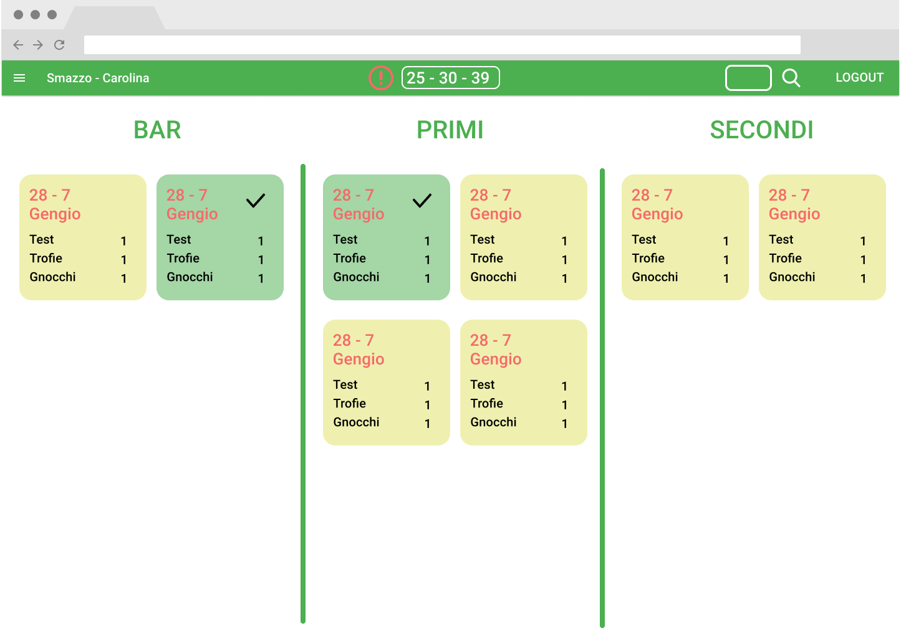
  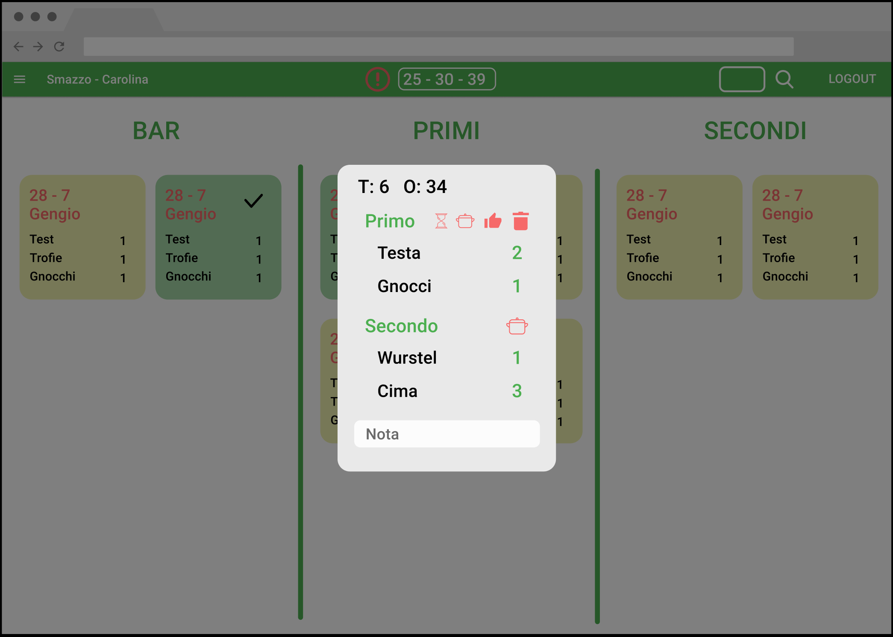
</p>

[⮝ torna all'indice](#indice)

<div style="page-break-after: always;"></div>

### Stima dei costi

Le informazioni di seguto sono indicative. Le letture (r) e scritture (w) si riferiscono ai documenti nel Firestore DB e dipendono dall'implementazione descritta nella seconda parte di questo documento.

#### Condizioni e ipotesi

- Prezzi: €0,06/100000r & €0,18/100000w
- n = # portate per ordine ~ 4
- a = # admin collegati ~ 1 (è improbabile che l'admin resti attivi continuamente)
- s = # smazzi collegati ~ 1
- ca = # casse collegate ~ 2
- cu = # cucine per portata ~ 1,2 (1 per la cucina in se + 1 per il galoppino)
- il cameriere conclude l'ordine, non lo smazzo
- le prime 50K r e 20k letture del giorno sono gratis

#### Nuovo ordine

2a+ca+2 r & n+3 w

| qt  | tipo | desc                                                                         |
| :-: | :--: | ---------------------------------------------------------------------------- |
|  1  |  r   | in service/current per sapere lastOrderID                                    |
|  1  |  w   | in service/current per aggiornare lastOrderID e altri parametri del servizio |
|  1  |  w   | in service/current/orders per creare un nuovo ordine                         |
|  n  |  w   | in service/current/courses per creare le nuove portate                       |
|  1  |  w   | in service/current/storage per aggiornare le quantità in storage             |
| ca  |  r   | per aggiornare le quantità della cassa                                       |
|  a  |  r   | per aggiornare le quantità in magazzino dell'admin                           |
|  a  |  r   | per aggiornare le info sul servizio dell'admin                               |
|  1  |  r   | per aggiornare l'ordine pendente dello smazzo                                |

#### Legame cameriere: n+2 r & 1 w

| qt  | tipo | desc                                                           |
| :-: | :--: | -------------------------------------------------------------- |
|  1  |  w   | in service/current/orders per segnare il cameriere nell'ordine |
|  1  |  r   | per mostrare il proprio ordine al cameriere                    |
|  1  |  r   | per rimozione dell'ordine pendente dallo smazzo                |
|  n  |  r   | per la visualizzazione delle portate dell'ordine al cameriere  |

<div style="page-break-after: always;"></div>

#### ciclo cameriere -> cucina -> smazzo : n(3+2cu+3s) r & 3n w

|    qt     | tipo | desc                      |
| :-------: | :--: | ------------------------- |
| cameriere |
|     1     |  w   | cambio stato wait->prep   |
|     1     |  r   | cambio stato wait->prep   |
|     1     |  r   | cambio stato prep->pronto |
|     1     |  w   | cambio stato pronto->cons |
|     1     |  r   | cambio stato pronto->cons |
|  cucina   |
|    cu     |  r   | cambio stato wait->prep   |
|     1     |  w   | cambio stato prep->pronto |
|    cu     |  r   | cambio stato prep->pronto |
|  smazzo   |
|     s     |  r   | cambio stato wait->prep   |
|     s     |  r   | cambio stato prep->pronto |
|     s     |  r   | cambio stato pronto->cons |

#### Totale

| qt           |          r          |  w   |
| :----------- | :-----------------: | :--: |
| creazione    |       2a+ca+2       | n+3  |
| collegamento |         n+2         |  1   |
| ciclo        |     n(3+2cu+3s)     |  3n  |
| totale       | n(4+2cu+3s)+2a+ca+4 | 4n+4 |

#### Ipotesi reale

n=4 a=1 s=1 ca=2 cu=2 => 52r/ord & 18w/ord

Considerato questa assunzione corretta, al giorno si possono fare gratis poco più di 900 ordini

Senza contare la parte gratita al giorno:

n=4 a=1 s=1 ca=2 cu=2 => 52r/ord & 18w/ord

4000 ordini = 208000 r & 72000 w ~ €0.13 & €0.13

#### Ipotesi assurda

ipotesi: 400 r/ord - 400 w/ord

Considerato questa assunzione corretta, al giorno si possono fare gratis poco più di 50 ordini

Senza contare la parte gratuita

4000 ordini = 1600000 r - 1600000 w = $0,96 + $2,56

[⮝ torna all'indice](#indice)

### Note

Avere dati sull'evoluzione delle quantità in magazzino

[⮝ torna all'indice](#indice)

<div style="page-break-after: always;"></div>

## Parte II - implementazione

App relies on 2 main technologies:

- [Firebase](https://firebase.google.com/): a BaaS(Back-end as a Service) supported by Google. It will be used for:
  - hosting
  - real time DB
  - server-side functions
- [React](https://reactjs.org/): a UI library created and maintained by Facebook to build user interfaces based on components and state.

[⮝ back to table of contents](#indice)

### Firestore DB structure

#### sagre

One document for each 'sagra' of type ISagra with 2 subcollections:

- #### storage

  Only one document which contains an IStorage Object

- #### services

  Each document is a single service of a 'sagra' with 3 subcollections:

  - _instantOrders_: each document is of type IInstantOrder
  - _orders_: each document is of type IOrder
  - _courses_: each document is a course of type ICourse

#### users

Each document corresponds to a user in the app, it could be useful for future use.

#### userSagraRoles

Each document corresponds to a user and contains a 'roles' property which is a string[] which contains all roles of the user. Each document is linked with a user by its id, building it as `r_${uid}`.

[⮝ back to table of contents](#indice)

<div style="page-break-after: always;"></div>

### Security rules

```ts
match / {
  function isLoggedIn() {
    return request.auth.id != null;
  }

  function hasRole(reqRole) {
    request.auth.token.reqRole == true;
  }

  function notUpdating(field) {
    return !(field in request.resource.data) || resource.data[field] == request.resource.data[field]
  }
  match /userRoles {
    allow read: if false; // only cloud functions
    allow write: if false; // only cloud functions
  }
  match /users  {
    allow read: if false; // only cloud functions
    allow write: if false; // only cloud functions
  }
  match /sagre {
    match /storage/{storageId} {
      allow get: if isLoggedIn() && hasRole(admin) || hasRole(cassa) || hasRole(cameriere);
      allow list: if false;
      allow create: if false; // only cloud functions
      allow update: if isLoggedIn() && hasRole(admin);
      allow delete: if false; // only cloud functions
    }
    match /services/{serviceID} {
      allow create: if isLoggedIn() && hasRole(admin);
      allow update: if isLoggedIn() && hasRole(admin); // add not updating property
      match /orders/{orderID} {
        allow read: if isLoggedIn() && hasRole(smazzo) || hasRole(cameriere) && waiterID == user.uid;
        allow create: if false; // only cloud functions
        allow update: if isLoggedIn() && hasRole(cassa) || hasRole(cameriere) && waiterID == user.uid;
      }
      match /courses/{courseID} {
        allow read: if isLoggedIn() && hasRole(smazzo) || hasRole(cameriere); // problem: waiter can read other waiter's courses
        allow create: if false; // only cloud functions
        allow update: if isLoggedIn() && hasRole(cassa) || hasRole(cameriere); // problem: waiter can update other waiter's courses
      }
      match /instantOrders/{instantOrderID} {
        allow read: if false;
        allow create: if isLoggedIn() && hasRole(cassaBar);
        allow update: if false;
        allow delete: if false;
      }
    }
  }
  allow read: if false;
  allow write: if false;
}
```

[⮝ back to table of contents](#indice)

<div style="page-break-after: always;"></div>

### Typescript Interfaces

#### Firestore

```ts
interface IUserSagraRolesDoc {
  name: string;
  roles: string[];
}
```

```ts
interface ISagra {
  year: number;
  totalRevenue: number;
  totalInstantRevenue: number;
  totalPeople: number;
  totalOrders: number;
  totalInstantOrders: number;
}
```

```ts
interface IDish {
  shortName: string;
}
```

```ts
interface ICourseDish extends IDish {
  qt: number;
}
```

```ts
interface IStorageDish extends IDish {
  courseName: string;
  name: string;
  storageQt: number;
  price: number;
  isInMenu: boolean;
  isInstant: boolean;
}
```

```ts
export interface IStorage {
  storageDishes: IStorageDish[];
}
```

```ts
interface IService {
  start: Date | null;
  end: Date | null;
  totalRevenue: number;
  totalInstantRevenue: number;
  totalPeople: number; // total number of people
  lastOrderNum: number; // progressive counter for orders
  totalInstantOrders: number;
  totalOrders: number;
  startingDishes: ICourseDish[];
}
```

```ts
interface IInstantOrder {
  revenue: number;
  dishes: ICourseDish[];
}
```

```ts
interface IOrder {
  orderNum: number;
  status: string; // (pending, active, completed, deleted)
  waiterName: string; // display name of waiter
  waiterId: string; // id of waiter to link
  table: number;
  revenue: number;
  notes: string;
}
```

```ts
interface ICourse {
  courseName: string;
  kitchen: string;
  orderNum: number;
  status: string; // (wait,prep,ready,delivered)
  notes: string;
  dishes: ICourseDish[];
}
```

#### React

```ts
interface IOrderWithId extends IOrder {
  // id is added to reach document in firestore faster
  docId: string;
}
```

```ts
interface ICourseWithId extends ICourse {
  // id is added to reach document in firestore faster
  docId: string;
}
```

```ts
interface IOrderLinkInfo {
  orderNum: number;
  tableNum: number;
  waiterName: string;
}
```

```ts
interface IReducerAction {
  type: string;
  payload: unknown;
}
```

[⮝ back to table of contents](#indice)

<div style="page-break-after: always;"></div>

### URLs

domain = (e.g. sagra.genova.cngei.it)

- [home](#domain) = domain
- [login](#domain/login) = domain/login
- [admin](#domain/admin) = domain/admin
- [primi](#basebarprimisecondi) = domain/primi
- [secondi](#basebarprimisecondi) = domain/secondi
- [bar](#basebarprimisecondi) = domain/bar
- [cassa](#domain/cassa) = domain/cassa
- [cassaBar](#domain/cassaBar) istantanea = domain/cassaBar
- [cameriere](#domain/cameriere) = domain/cameriere

### React Components

Assumption (need to be checked during development): for all Components where a user event triggers a change in firestore there is no need to add a reducer but only a listener that acts on the state. Actions will pass through firestore on-device cache first and then propagate to other UIs via DB and then trigger the snapshot. In those components where a reducer is needed (cassa, cassBar) there should not be the need also for context, should be maximum 2-level prop-drilling, which doesn't make the use of Context so imminent.

Base structure:

- [ ] App
  - [ ] SagraContextProvider
  - [ ] AppBar
    - [ ] MenuDrawer
    - [ ] PendingOrders
    - [ ] DeleteOrderButton
      - [ ] DeleteOrderModal
    - [ ] SearchOrderButton
      - [ ] SearchOrderModal
        - [ ] SearchOrderModalCourse
  - [ ] PrivateRoleRoute

App

- material UI theme builder
- CSS Baseline
- AppBar
- router and switch with all PrivateRoleRoute for pages except for login
- useState = {isLoggedIn : boolean, roles: string[], name: string}
- useState = {serviceDbRef: string, storageDbRef: string}
- in useEffect setup onetime listener for firebase.auth() to change state

AppBar (isUserLoggedIn : boolean, userRoles: string[])

- if userLoggedIn show name, role, logout button
- if userRoles includes 'smazzo' and url is '/smazzo' show also search button and pending orders
- if userRoles includes 'cassa' and url is '/cassa' show also delete button
- on logoutButton click log out user and redirect to login page

PendingOrders

- getCurrentService
- setup firebase snapshot on orders collection where state='pending'
- useState = orders where state='pending'
- if there are more than 1 order show attention icon
- display id of each order
- _LAST_ could signal if an order is waiting for too long

MenuDrawer (userRoles : string[])

- contains links to reachable pages by user based on userRoles

DeleteOrderButton

- on click trigger DeleteOrderModal

DeleteOrderModal

- text input for number of order to delete
- on click deleteButton call deleteOrder cloud function

SearchOrderButton

- display a text input and a button
- on click trigger SearchOrderModal

SearchOrderModal (orderNum : number)

- useState = {order : IOrderWithId, courses : ICoursesWithId[]}
- listen to order by orderNum and coures with orderNum = arg
- map courses to SearchOrderModalCourse

SearchOrderModalCourse (course : ICourseWithID)

- display course name
- create obj iconState {state : icon}
- display icon different from state
- on click modifiy set state in db accordingly
- map dishes to DishRow

PrivateRoleRoute (component : FComponent, authed : boolean, required roles : string[])

- if user not logged in redirect to login
- if user logged in but urel not in role redirect to home
- else return route to page page

<div style="page-break-after: always;"></div>

#### domain/

- [ ] HomePage

HomePage

- loop through user costum claims and display buttons
- display a link button for each route reachable by user based on userRoles
- if userRoles is empty show message to go to superAdmin and get role

#### domain/login

- [ ] LoginPage
  - [ ] LoginDialog
  - [ ] RegisterDialog

LoginPage

- if user is logged in redirect to home
- else
  - notLoggedIn messagge
  - loginButton to trigger LoginDialog
  - registerButton to trigger RegisterDialog

LoginDialog

- state = loginError (false)
- fields: email and password
- on login if user redirect to home
- _LAST_ on login if user has at least a role redirect to role page else to home
- if loginError show message under form

#### domain/register

RegisterDialog

- state = registerError (false)
- fields: email, password, confirm password, name
- on register if user redirect to home
- _LAST_ on register if user has at least a role redirect to role page else to home- if registerError show message under form

<div style="page-break-after: always;"></div>

#### domain/admin

- [ ] AdminPage
  - [ ] StorageTab
    - [ ] StorageCourse
      - [ ] StorageDish
      - [ ] AddDishButton
  - [ ] ServiceTab
    - [ ] ServiceStarter
    - [ ] ServiceInfo

AdminPage

- 2 sections: StorageTab, ServiceTab
- getCurrentService
- setup listener for service where EndDate = null
- getCurrentStorage
- setup listener for storage document
- useState = storage

StorageTab (startingCourses : IStartingCourses, courses : IStorageCourse[])

- map courses of storage and starting courses to StorageCourse

StorageCourse (storageCourse : IStorageCourse, startingCourse : IStartingCourse)

- map dishes in storageCourse to StorageDish and pass single dish as prop with also corresponding starting dish value
- _LAST_ plus button to add dish

StorageDish (storageDish : IStorageDish, startingDishQt : number)

- render infos from props
- useState = isEditing
- on editButton click set isEditing to true
- if isEditing==true becomes check icon to finish, text inputs enables
- on checkButton click, update stroage in DB and set isEditing=false

ServiceTab (service : IService, currentStorage : ICourses[], serviceRef)

- useState = current service
- if service exists pass isServiceActive=true as prop to serviceStarter else pass false
- if service exists display ServiceInfo and pass service as prop

ServiceStarter (isServiceActive : boolean)

- if isServiceActive is true show red button to end it, i.e. set endDate where endDate is not defined
- if isServiceActive is not active show green button to start it, i.e. create new service with endDate undefined

ServiceInfo (service : IService)

- display current service info from props

<div style="page-break-after: always;"></div>

#### domain/cassa

- [ ] CashRegisterPage
  - [ ] CashRegisterCourse
    - [ ] CashRegisterDish
  - [ ] CashRegisterConfirmOrder

CashRegisterPage

- getCurrentStorage
- setup listener for storage
- filter courses from storage where inMenu==true and set them to state(storage)
- useState = storage : IStorageCourse[]
- useReducer =
  - newOrder : {orderNum: number, total: number, courses: IStorageCourse[]}
  - dispatchActions: IReducerAction
    - (ADD_DISH, dishName)
    - (REMOVE_DISH, dishName)
    - SEND_ORDER
    - PRINT_ORDER
    - RESET_ORDER
- map state(storage) to list of CashRegisterCourse, if in newOrder there is a course with same name pass it as prop
- one card with CashRegisterConfirmOrder pass newOrder revenue

CashRegisterCourse (courseInMenu : IStorageCourse, courseInOrder ?: IStorageCourse, dispatch)

- map dishes to CashRegisterDish, if in courseInOrder there is a dish with the same name pass the qt as prop as prop

CashRegisterDish (courseInMenu : IDish, newOrderQt : number, dispatch)

- a row with dish name, qt in storage, '-'. '+' and newOrderQt
- on click of '-' and '+' trigger dispatch action with name of dish

CashRegisterConfirmOrder (revenue: number, orderNum ?: number )

- display revenue from props
- display sendButton, on click of sendButton dispatch SEND_ORDER action
- display send button on click of printButton dispatch PRINT_ORDER action
- display orderNum
- display resetOrderButton

cash register reducer actions:

- ADD_DISH: (payload = dishName)
  - copy state and find course where dishes includes a dish==payload, increment qt and recalculate revenue
- REMOVE_DISH:
  - copy state and find course where dishes includes a dish==payload, decrement qt and recalculate revenue
- SEND_ORDER:
  - call createOrder firebase cloud function with undefined as orderNum argument, then set orderNum as the one received
- PRINT_ORDER:
  - trigger print function
- RESET_ORDER:
- set newOrder to [] and orderNum to undefined

<div style="page-break-after: always;"></div>

#### domain/cassaBar

- [ ] InstantCashRegisterPage
  - [ ] CashRegisterCourse
    - [ ] CashRegisterDish
  - [ ] InstantCashRegisterConfirmOrder

InstantCashRegisterPage

- getCurrentStorage
- getCurrentService
- setup firestore listener for storage
- useState = all courses in storage where isInstant=true
- add useReducer:
  - useState: {newOrder : StorageCourse[]}
  - dispatchActions:
    - ADD_DISH
    - REMOVE_DISH
    - SEND_ORDER
- map state to CashRegisterCourse and pass single course as props

InstantCashRegisterConfirmOrder

- display total from props
- on click of sendButton dispatch SEND_ORDER action

<div style="page-break-after: always;"></div>

#### domain/cameriere

- [ ] WaiterPage
  - [ ] WaiterOrder
    - [ ] WaiterOrderCourse
      - [ ] DishRow
    - [ ] AddDishModal
      - CashRegisterCourse
        - CashRegsiterDish
      - [ ] WaiterEditOrderConfirm
  - [ ] LinkOrderButton
  - [ ] LinkOrderModal

WaiterPage

- getCurrentService
- in one-time useEffect listen for orders with waiterId == userID.uuid and status='active' (get from firebase.auth().currentUser)
- map orders to WaiterOrders and pass order as prop + firestoreId order by orderNum Desc

WaiterOrder (order : IOrderWithId)

- in one-time useEffect listen for courses with orderId equal to prop one and pass Course obj as prop + docId
- useState = isExpanded (false)
- display table# and orderId
- display close button, on click set status='completed'
- display unlink button, on click set status='pending'
- display expand button toggle isExpanded
- on click of AddCourseButton trigger AddDishModal
- if isExpanded = true map courses to WaiterCourse[]

WaiterCourse (course : ICourseWithId)

- when Course state == waiting, display pot button
- when Course state == prep, display cancelPot button and turn bkg yellowish
- when Course state == ready, display conclude button
- map Dishes to DishRow[]
- when click a button change state in db appropriately

DishRow (dish : IDish)

- display dish shortName and qt

AddDishModal (orderNum : number)

- display orderNum to edit
- getCurrentStorage
- setup in one-time useEffect a listener for storage doc
- useState = storage
- useReducer:
  - state=newCourses : ICourse[]
  - actions:
    - ADD_DISH
    - REMOVE_DISH
    - SEND_ORDER

WaiterEditOrderConfirm

- display total price of new courses
- display confirmButton
- on click on confirmButton dispatch SEND_ORDER

useReducer actions

- SEND_ORDER: call cloud function addCoursesToOrder

LinkOrderButton

- floating '+' button to trigger LinkOrderModal

LinkOrderModal

- 2 number inputs, orderNum and tableNum
- 1 'confirm' button, onClick change tableNum in DB order

<div style="page-break-after: always;"></div>

#### domain/(bar,primi,secondi)

- [ ] KitchenShelf
  - [ ] KitchenCourse
    - DishRow
- [ ] KitchenTotal
  - DishRow

KitchenPage

- getCurrentService
- in one-time useEffect setup listener for courses were status='prep' and kitchen is equal to url slug
- KitchenShelf pass docs as prop
- KitchenTotal pass docs as prop

KitchenShelf (courses : ICourseWithId[])

- map props to KitchenCourse

KitchenCourse (course : ICourseWithId)

- display order num
- map props to DishRow
- display note

KitchenTotal (courses : ICourseWithId[])

- reduce arrayProp to an array of IDIsh and map it to DishRow

<div style="page-break-after: always;"></div>

#### domain/smazzo

- [ ] SmazzoPage
  - [ ] CourseSection
    - [ ] SmazzoCourse

SmazzoPage

- getCurrentService
- create array with 3 kitchens and map it to a columns in which to render CourseSection and pass kitchen as prop

CourseSection (kitchen : string)

- setup listener for courses where kitchen is equal to prop and statua in ['prep','ready']
- useState = array of courses
- useState = array of OrderLinkInfo[]
- foreach document added get from firestore order where ordernum==course.orderNum and insert in OrderLinkInfo[] a new object with infos
- foreach document deleted get from firestore order where ordernum==course.orderNum and remove in OrderLinkInfo[] a new object with infos
- map courses to SmazzoCourse and pass Course and OrderLinkInfo

SmazzoCourse (course : ICourseWithId)

- render infos
- check button, on click set in db course.status='delivered'
- if status is prep then background is yellowish else greenish

[⮝ back to table of contents](#indice)

<div style="page-break-after: always;"></div>

### Cloud functions

#### callables

- [ ] createOrder

  (order : IOrder) => {} : number

  in a single transaction

  - change timeout ~ 90s

  1. read lastOrderNum of current service
  2. create a new order with lastOrderNum++
  3. update lastOrderNum
  4. increase total revenue of service
  5. increase storage qts
  6. increase totalPeople
  7. increase totalOrders
  8. update service consumed props

- [ ] addCoursesToOrder
      (orderNum : number, courses : ICourses[]) => {} : boolean

  2. add new courses in courses collections with orderNum equal to arg
  3. update storage

- [ ] deleteOrder
      (orderNum : number) => {} : boolean
  2. decrease total revenue of service
  3. decrease storage qts
  4. decrease totalPeople
  5. decrease totalOrders
  6. update service consumed props

#### triggers

- [x] onCreate on instantOrder

  - need to get more info on idempotency

  1. update totalRevenue of current service
  2. update totalInstantOrders of current service
  3. update qts in storage

- [x] new user registration

  1. create new record in userSagraRoles collection with 'roles' field = []
  2. create new reacord in users with empty doc

- [x] user deletion
      a single batch

  1. delete user record from userSagraRole
  2. delete user record from users

- [x] onUpdate on sagraUserRoles
  1. delete all userCostum claims
  2. for each role in user add userCostumClaims 'role' = true

[⮝ back to table of contents](#indice)

## Helper functions

- [ ] getCurrentStorageRef

- [ ] getCurrentServiceRef

## Logging

L'app deve loggare le evoluzioni degli ordini per avere dati statistici

[⮝ back to table of contents](#indice)

## Appunti
