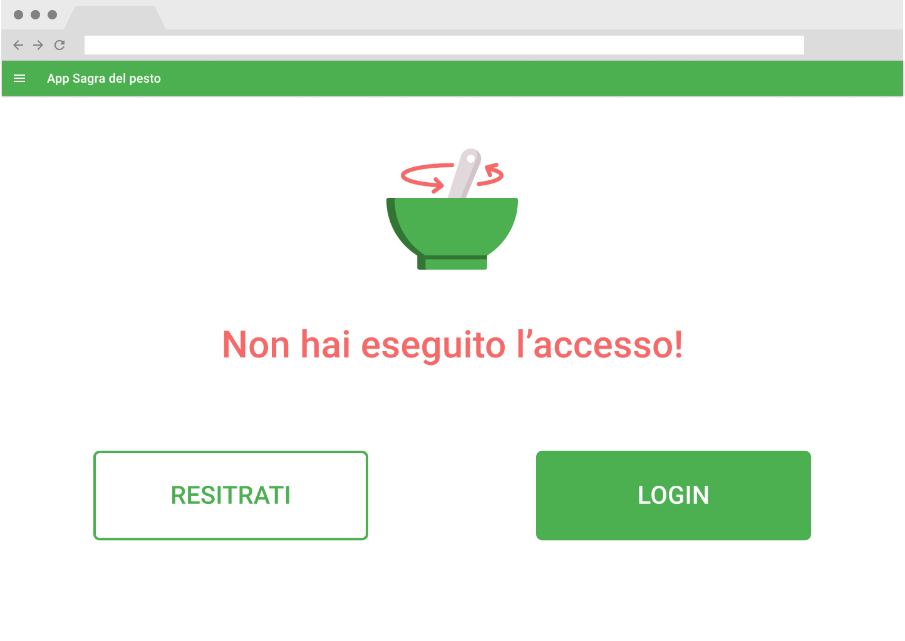
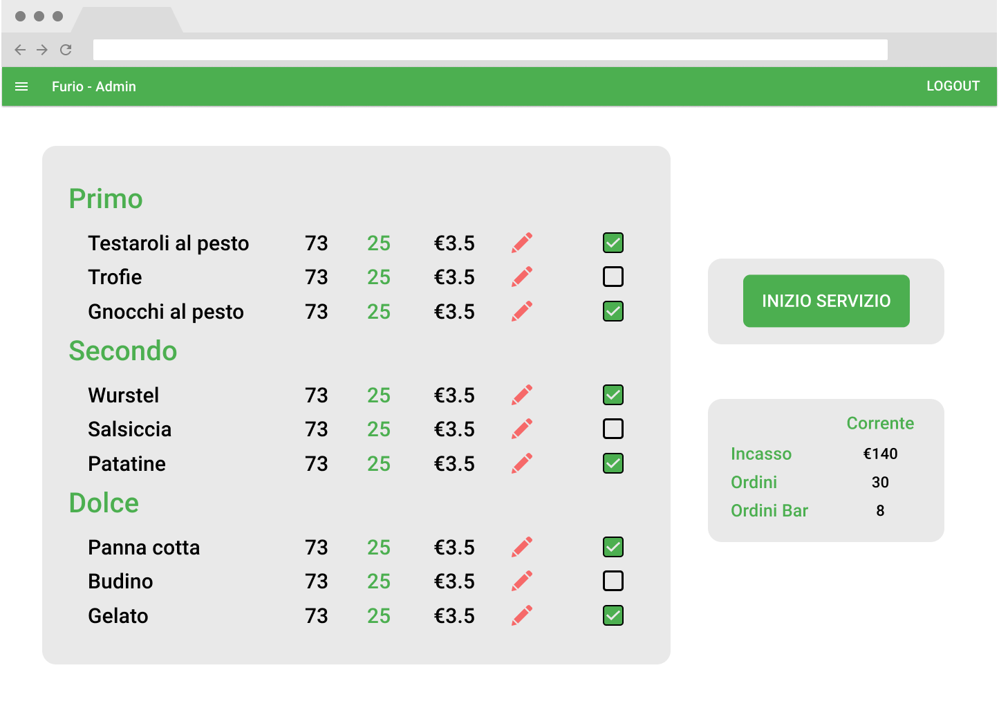
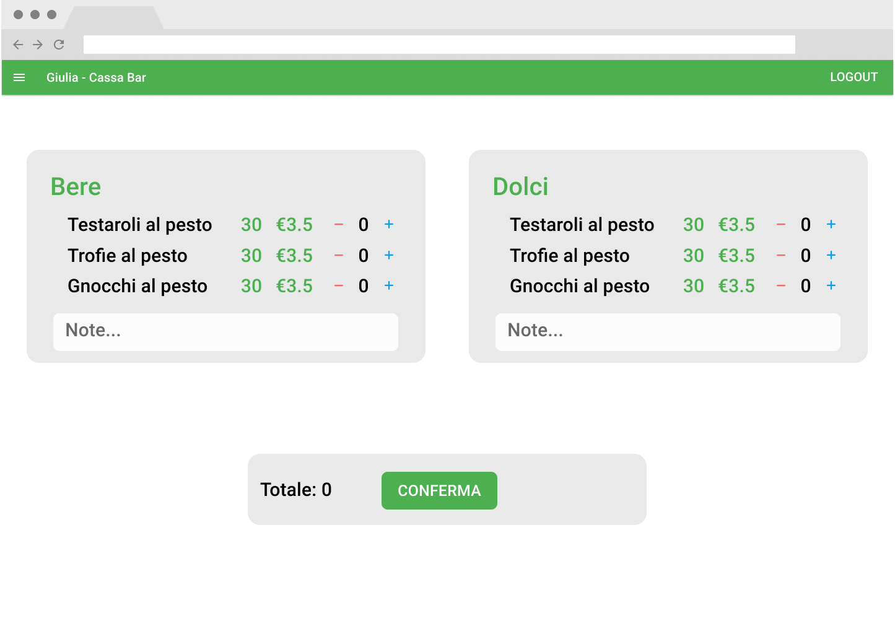
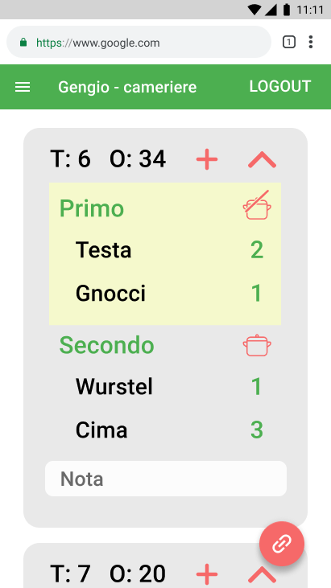
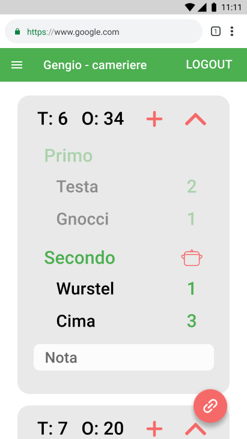
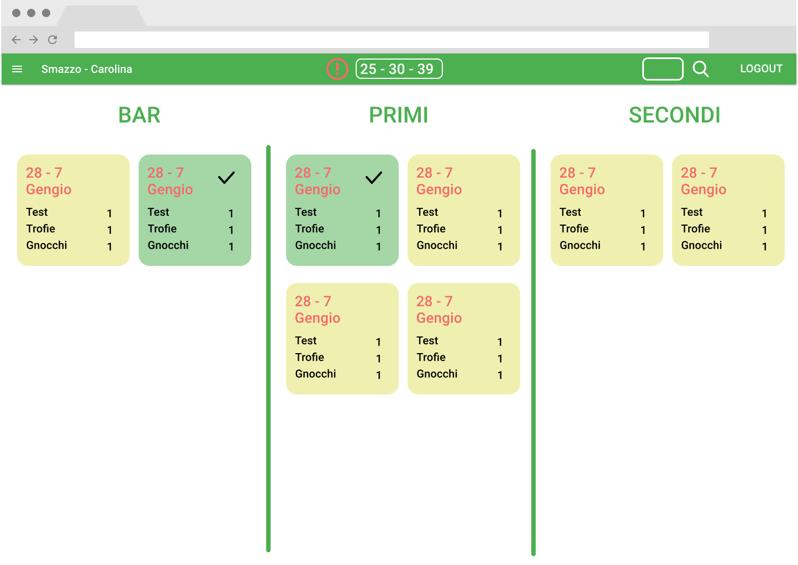

# Requisiti

Di seguito la documentazione dell'app per gestire gli ordini della Sagra del Pesto di Genova. La prima parte descrive il funzionamento dell'app, la seconda descrive la guida per l'implementazione. L'app è pensata come parte di un'infrastuttura più generale per gestire l'IT della sezione di Genova.

Le parti precedute da _LAST_ sono funzioni non essenziali che potrebbero non essere presenti nell'app entro giugno.

## Indice

- [Requisiti](#requisiti)
  - [Indice](#indice)
  - [Obbiettivi](#obbiettivi)
  - [Evoluzione di un ordine](#evoluzione-di-un-ordine)
  - [Ruoli Utente](#ruoli-utente)
  - [Attività dei ruoli](#attività-dei-ruoli)
  - [Permessi dei ruoli](#permessi-dei-ruoli)
  - [Mokcup pagine](#mokcup-pagine)
  - [Stima dei costi](#stima-dei-costi)
  - [Note](#note)

## Obbiettivi

L'applicazione ha l'obbiettivo di migliorare la gestione degli ordini della sagra, fornendo:

- miglior interazione tra i vari organi operativi
- aggiornamenti in tempo reale sullo stato degli ordini
- maggiore visione d'insieme da parte di smazzo e responsabili
- interfacce personalizzate per ciascun componente in base al ruolo
- possibilità di analisi dei dati post-sagra per poter migliorare le spese e l'organizzazione
- un'architettura google cloud per una maggiore affidabilità e resilienza dei dati
- un prodotto espandibile e modificabile per fondare le basi dell'informatizzazione della sezione di Genova

[⮝ torna all'indice](##indice)

## Evoluzione di un ordine

Alcune nozioni fondamentali sull'app:

- _servizio_: sessione di pasto (pranzo, cena)
- _ordine_ istantaneo: ordine fatto dal bar che viene consegnato al cliente direttamente
- _ordine_ (classico): ordine normale fatto dalla cassa che deve passare attraverso cameriere -> cucina -> smazzo
- _portata_: elemento dell'ordine preparato da una singola cucina
- _piatto_: elemento di una portata
- ogni piatto deve possedere un nome 'corto' di massimo 7 lettere per facilitare la visualizzazione su certe pagine

L'app prevede che ogni membro attivo durante un servizio possieda un account (a parte forse alcuni camerieri). L'utilizzo è consentito esclusivamente agli utenti loggati, con certe limitazioni in base al ruolo. Un utente può avere più ruoli.

Una portata può essere gestita da solo una cucina. Un cucina può gestire più portate.

La minima entità dell'app è la portata di un ordine. E' l'oggetto che viene passato tra i vari 'centri' operativi della sagra (cameriere, cucina, smazzo).

L'evoluzione temporale di un ordine è la seguente:

1. il cliente arriva alla cassa;
2. il cassiere manda l'ordine al sistema;
3. lo smazzo vede la presenza di un ordine non ancora collegato a un cameriere;
4. il cliente si siede;
5. il cameriere collega l'ordine al suo tavolo;
6. il cameriere invia una portata alle cucine;
7. la cucina responsabile della portata vede la presenza di una portata da preparare;
8. la cucina prepara la portata e la segna come 'pronta';
9. lo smazzo e il cameriere vedono l'update;
10. lo smazzo controlla che l'ordine sia stato realizzato correttamente e lo passa al cameriere per portarlo al tavolo;
11. si ripete dal punto 6 al punto 10 per ogni portata.

[⮝ torna all'indice](##indice)

## Ruoli Utente

- [Super Admin](#super-admin)
- [Admin](#admin)
- [Cassiere](#cassiere)
- [Cameriere](#cameriere)
- [Bar](#bar)
- [Primi](#primi)
- [Secondi](#secondi)
- [Smazzo](#smazzo)

[⮝ torna all'indice](##indice)

## Attività dei ruoli

### Super admin

- modificare i ruoli degli utenti

### Admin

- modificare le quantità in 'magazzino'
- _LAST_ aggiungere piatti al magazzino
- modificare il menu
- iniziare e concludere il servizio
- vedere info su incassi e ordini correnti

### Cassiere

- creare un ordine
- aggiungere una nota a ogni portata dell'ordine
- stampare un ordine
- cancellare un ordine già creato
- _LAST_ modificare un ordine già creato

### Cameriere

- associare ordine e tavolo
- aggiungere una nota personale all'ordine per aiutare l'identificatione dei clienti
- mandare una portata di un ordine in cucina per la preparazione
- concludere una portata di un ordine
- aggiungere una portata a un ordine
- _LAST_ ricevere notifica quando un ordine è pronto

### Bar

- visualizzare il bere e i dolci degli ordini che sono in preparazione
- segnare il bere e i dolci come pronti
- creare ordini istantanei

### Primi

- visualizzare i primi degli ordini che sono in preparazione
- segnare i primi come pronti

### Secondi

- visualizzare i secondi degli ordini che sono in preparazione
- segnare i secondi come pronti

### Smazzo

- vedere gli ordini non collegati a un cameriere
- vedere le portate degli ordini in corso e il loro stato (in preparazione, pronto)
- concludere una portata di un ordine
- recuperare vecchie portate di ordini già conclusi per eventuali modifiche

[⮝ torna all'indice](##indice)

## Permessi dei ruoli

### Modifica ruoli utente

- Super admin

### Modifica menu

- Admin

### Modifica magazzino

- Admin

### Inizio/fine servizio

- Admin

### Creazione ordine

- Ordini classici solo cassa
- Ordini istantanei solo bar

### Modifica stato ordine

- Cassa
- Smazzo
- Cameriere modifica tutto solo i propri ordini

### Cancellazione ordine

- Cassa

### Modifica portate ordine

- Smazzo
- Cameriere modifica tutto solo i propri ordini
- Cucine modificano solo le proprie portate

[⮝ torna all'indice](##indice)

## Mokcup pagine

Le immagini mostrate sono delle bozze, non è detto che rispettino fedelmente il prodotto finale.

Ogni pagina ha una top bar con:

- se loggato:
  - il nome dell'utente e la pagina (es: Alice-cassa)
  - un'icona per mostrare il menu con i link alle pagine accessibili dall'utente
  - un tasto per uscire dall'app
  - se il ruolo è 'smazzo'
    - una sezione con gli ordini pendenti
    - un tasto cerca per visualizzare una portata di un ordine
  - se il ruolo è cassa:
    - un tasto 'cestino' per eliminare un ordine già fatto
    - _LAST_ un tasto 'matita' per modificare un ordine già fatto

### Home

- Link che portano alle altre pagine accessibili dall'utente

 
 

  

### Login and Register

- Tasti per registrarsi o loggarsi

 
 

  

### Admin dashboard

- Una sezione per:
  - modificare il menu
  - modificare le quantità in magazzino
  - aggiungere e modificare piatti
- Un tasto per iniziare/concludere il servizio
- Una sezione con le info su ordini e incassi del servizio corrente

 
 

  

### Cassa istantanea

- Una sezione per ogni portata con i piatti istantanei nel menu. Ogni piatto è una riga con:
  - la quantità rimanente in magazzino
  - il prezzo
  - la quantità richiesta dal cliente
  - un tasto '-' per decrementare le quantità richieste dal cliente
  - un tasto '+' per incrementare le quantità richieste dal cliente
- Una sezione con:
  - il totale dell'ordine
  - un tasto per confermare l'ordine

 
 

  

### Cassa

- Una sezione per ogni portata con i piatti nel menu. Ogni piatto è una riga con:
  - la quantità rimanente in magazzino
  - il prezzo
  - la quantità richiesta dal cliente
  - un tasto '-' per decrementare le quantità richieste dal cliente
  - un tasto '+' per incrementare le quantità richieste dal cliente
- Una sezione contente:
  - il totale dell'ordine
  - un tasto per inviarlo al sistema
  - una box per vedere il numero dell'ordine
  - un tasto per stampare l'ordine
  - un tasto per resettare l'ordine per farne uno nuovo

  
  

### Cameriere dashboard

- Un tasto '+' per collegare ordine e tavolo
- Una sezione per ogni ordine con:
  - il numero dell'ordine
  - il numero del tavolo
  - un tasto per aggiungere portate all'ordine
  - un tasto per espandere comprimere l'ordine per non occupare inutile spazio
  - le portate dell'ordine, contenente:
    - un tasto per completare la portata
    - un tasto per mandare la portata in preparazione
    - una riga per piatto con nome e quantità

 
 

  
  
  
  
  

### Cucine/bar

- Una sezione ampia con tutti gli ordini in preparazione della propria cucina, ognuno con un tasto per segnarli completati
- Una mini sezione con il totale dei piatti da preparare attualmente

 
 

  
  

### Smazzo page

- 3 colonne (bar, primi, secondi), contentti le portate degli ordini in corso e il loro stato (preparazione, pronto). Ogni portata contiene:
  - lista dei piatti
  - tasto per concludere la portata

 
 

  
  

[⮝ torna all'indice](##indice)

## Stima dei costi

Le informazioni di seguto sono indicative. Le letture (r) e scritture (w) si riferiscono ai documenti nel Firestore DB e dipendono dall'implementazione descritta nella seconda parte di questo documento.

### Condizioni e ipotesi

- Prezzi: €0,06/100000r & €0,18/100000w
- n = # portate per ordine ~ 4
- a = # admin collegati ~ 1 (è improbabile che l'admin resti attivi continuamente)
- s = # smazzi collegati ~ 1
- ca = # casse collegate ~ 2
- cu = # cucine per portata ~ 1,2 (1 per la cucina in se + 1 per il galoppino)
- il cameriere conclude l'ordine, non lo smazzo
- le prime 50K r e 20k letture del giorno sono gratis

### Nuovo ordine

2a+ca+2 r & n+3 w

| qt  | tipo | desc                                                                         |
| :-: | :--: | ---------------------------------------------------------------------------- |
|  1  |  r   | in service/current per sapere lastOrderID                                    |
|  1  |  w   | in service/current per aggiornare lastOrderID e altri parametri del servizio |
|  1  |  w   | in service/current/orders per creare un nuovo ordine                         |
|  n  |  w   | in service/current/courses per creare le nuove portate                       |
|  1  |  w   | in service/current/storage per aggiornare le quantità in storage             |
| ca  |  r   | per aggiornare le quantità della cassa                                       |
|  a  |  r   | per aggiornare le quantità in magazzino dell'admin                           |
|  a  |  r   | per aggiornare le info sul servizio dell'admin                               |
|  1  |  r   | per aggiornare l'ordine pendente dello smazzo                                |

### Legame cameriere: n+2 r & 1 w

| qt  | tipo | desc                                                           |
| :-: | :--: | -------------------------------------------------------------- |
|  1  |  w   | in service/current/orders per segnare il cameriere nell'ordine |
|  1  |  r   | per mostrare il proprio ordine al cameriere                    |
|  1  |  r   | per rimozione dell'ordine pendente dallo smazzo                |
|  n  |  r   | per la visualizzazione delle portate dell'ordine al cameriere  |

### ciclo cameriere -> cucina -> smazzo : n(3+2cu+3s) r & 3n w

|    qt     | tipo | desc                      |
| :-------: | :--: | ------------------------- |
| cameriere |
|     1     |  w   | cambio stato wait->prep   |
|     1     |  r   | cambio stato wait->prep   |
|     1     |  r   | cambio stato prep->pronto |
|     1     |  w   | cambio stato pronto->cons |
|     1     |  r   | cambio stato pronto->cons |
|  cucina   |
|    cu     |  r   | cambio stato wait->prep   |
|     1     |  w   | cambio stato prep->pronto |
|    cu     |  r   | cambio stato prep->pronto |
|  smazzo   |
|     s     |  r   | cambio stato wait->prep   |
|     s     |  r   | cambio stato prep->pronto |
|     s     |  r   | cambio stato pronto->cons |

### Totale

| qt           |          r          |  w   |
| :----------- | :-----------------: | :--: |
| creazione    |       2a+ca+2       | n+3  |
| collegamento |         n+2         |  1   |
| ciclo        |     n(3+2cu+3s)     |  3n  |
| totale       | n(4+2cu+3s)+2a+ca+4 | 4n+4 |

### Ipotesi reale

n=4 a=1 s=1 ca=2 cu=2 => 52r/ord & 18w/ord

Considerato questa assunzione corretta, al giorno si possono fare gratis poco più di 900 ordini

Senza contare la parte gratita al giorno:

n=4 a=1 s=1 ca=2 cu=2 => 52r/ord & 18w/ord

4000 ordini = 208000 r & 72000 w ~ €0.13 & €0.13

### Ipotesi assurda

ipotesi: 400 r/ord - 400 w/ord

Considerato questa assunzione corretta, al giorno si possono fare gratis poco più di 50 ordini

Senza contare la parte gratuita

4000 ordini = 1600000 r - 1600000 w = $0,96 + $2,56

[⮝ torna all'indice](##indice)

## Note

Avere dati sull'evoluzione delle quantità in magazzino

[⮝ torna all'indice](##indice)

